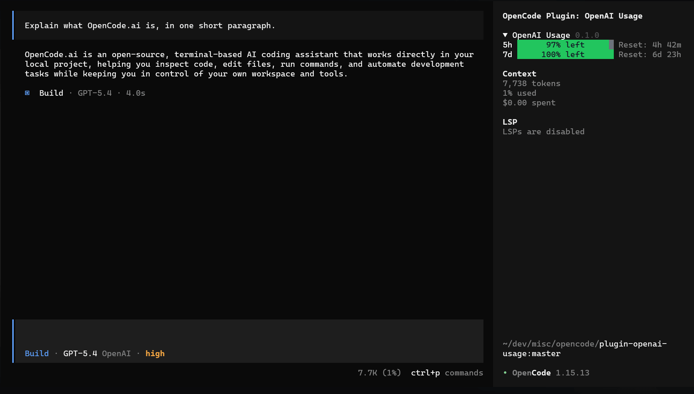
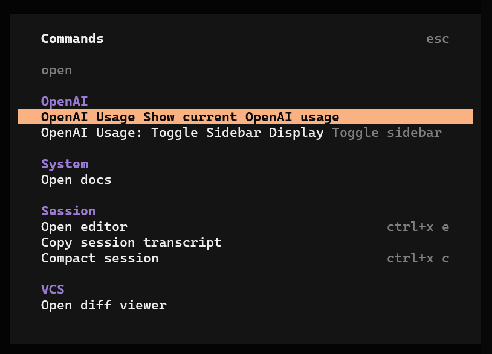
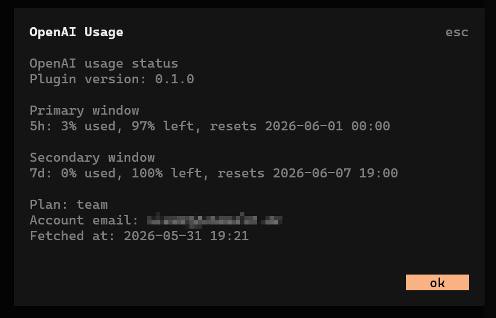
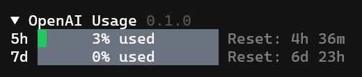
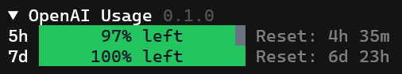

# opencode-openai-usage

OpenCode plugin that reads your ChatGPT account usage and shows it in the TUI sidebar and command palette.

The sidebar panel starts expanded and can be collapsed.



## What It Does

- fetches usage data from OpenAI Backend API
- reads the OpenCode OpenAI OAuth token from OpenCode's local state
- shows usage windows in the collapsible sidebar
- adds `OpenAI Usage` and `OpenAI Usage: Toggle Sidebar Display` commands to the TUI command list

## Screenshots

### Command Palette

Shows the OpenAI-specific commands added by the plugin.



### Usage Dialog

Shows the detailed usage summary, including the current usage windows and account details returned by the upstream endpoint.



### Sidebar Display Modes

The sidebar can show either used quota or remaining quota.

Used mode:



Left mode:



## Requirements

- OpenCode with an OpenAI account connected via OAuth
- Node.js and npm available for installation/build steps

## Install From npm

Add the runtime plugin in `opencode.json`:

```json
{
  "$schema": "https://opencode.ai/config.json",
  "plugin": ["opencode-openai-usage"]
}
```

Add the TUI plugin in `tui.json`:

```json
{
  "$schema": "https://opencode.ai/tui.json",
  "plugin": [["opencode-openai-usage/tui", { "invert": false }]]
}
```

After changing config, quit and restart OpenCode.

## TUI Options

The TUI plugin accepts options in `tui.json`:

```json
{
  "$schema": "https://opencode.ai/tui.json",
  "plugin": [["opencode-openai-usage/tui", { "invert": true }]]
}
```

| Option | Default | Description |
|---|---|---|
| `invert` | `false` | Default sidebar mode. `false` shows used quota like `60% used`; `true` shows remaining quota like `40% left`. After the `OpenAI Usage: Toggle Sidebar Display` command is used, the last selected mode is persisted across restarts. |

## Project Structure

```text
src/
  index.ts
  tui.tsx
  lib/openai-usage.ts
.opencode/
  plugins/openai-usage.ts
  tui/openai-usage.tsx
  tui.json
```

## Notes And Limitations

- The plugin depends on OpenCode's locally stored `auth.json` format.
- The usage endpoint is an internal ChatGPT web endpoint and may change without notice.
- The plugin caches usage data locally in OpenCode's state directory.
- The plugin hides its sidebar panel and commands when OpenCode has no OpenAI OAuth account configured.
- The command summary currently includes the account email returned by the upstream endpoint.

## License

MIT
